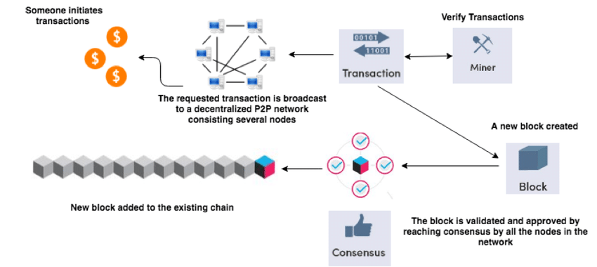
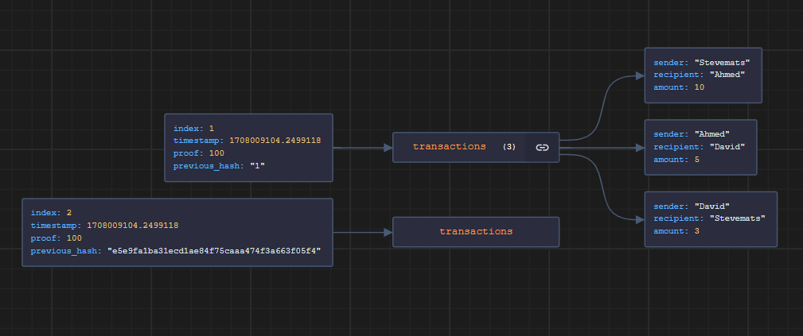

# Blockchain Implementation in Python

This is just but a simple demonstration of a [blockchain](https://en.wikipedia.org/wiki/Blockchain) implemented in [Python](https://wiki.python.org/moin/BeginnersGuide). The purpose of this demonstration is to show how blockchain works and how transactions are added to blocks and mined.


---

---

## Prerequisites

- [Python 3](https://www.python.org/downloads/) installed on your machine.

## Running the Code

1. Clone this repository to your local machine.

```
 git clone https://github.com/stevemats/DLT_Implementation.git
```

2. Navigate to the directory where the `blockchain.py` file is located.
3. Run the script by typing `python blockchain.py` in your terminal or command prompt.

---

---

## Code Explanation



1. The `Blockchain` class represents a simple blockchain. It has methods for adding transactions, mining blocks, and creating new blocks.
2. The code includes a menu system with options to add transactions, view the blockchain, mine a block, save the blockchain to a file, load the blockchain from a file, and exit the program.
3. When you run the script, it creates a new `Blockchain` instance and enters a menu loop that prompts the user for input.
4. The user can add transactions, view the blockchain, mine a block, save the blockchain to a file, load the blockchain from a file, or exit the program by selecting the corresponding option from the menu.
5. If a valid proof of work is found, the new block is added to the blockchain, and the full blockchain is printed.
6. If a valid proof of work is not found within the maximum number of iterations, a message is printed indicating that the proof of work was not found.

## Functionalities

- **Add Transactions**: You can add transactions to the current block by selecting the `Add Transaction` option from the menu and providing the sender, recipient, and amount.
- **View Blockchain**: You can view the full blockchain by selecting the `View Blockchain` option from the menu.
- **Mine Blocks**: You can mine blocks by selecting the `Mine Block` option from the menu. The proof of work is a number that, when combined with the contents of the block, results in a hash with a certain number of leading zeros.
- **Save Blockchain**: You can save the blockchain to a file by selecting the `Save Blockchain` option from the menu and providing a filename.
- **Load Blockchain**: You can load the blockchain from a file by selecting the `Load Blockchain` option from the menu and providing a filename.
- **Exit Program**: You can exit the program by selecting the `Exit` option from the menu.

## Output

The output of the code is the full blockchain, including the initial block and the new block that was mined. If a valid proof of work is not found within the maximum number of iterations, the output will indicate that the proof of work was not found.



## Note on Output

The output of the code only includes the genesis block (the initial block) because a valid proof of work was not found within the maximum number of iterations. To get the actual/better result output, you need to increase the number of iterations in the code. This will increase the likelihood of finding a valid proof of work and generating a more complete blockchain.

```JSON
[
    {
        "index": 1,
        "timestamp": 1708009104.2499118,
        "transactions": [],
        "proof": 100,
        "previous_hash": "1"
    }
]
```

- Timestamp above is in unix format, you can convert it using the [datetime module](https://docs.python.org/3/library/datetime.html) to make it human-readable if need be.

Also note that the current_transactions list is not persisted anywhere, so it will be reset whenever the program is restarted(I've implemented a JSON method only for demo), to solve this issue, use a better approach like e.g a DB or some sort of other form of persistent storage to store the blockchain and the transactions.
